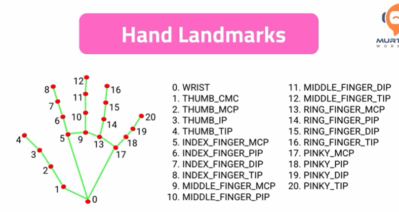

## ✋ Hand Tracking with **MediaPipe and OpenCV**

##  Technologies Used

- **Python**: 3.10.11  
- **MediaPipe**: Pose & Hands solutions  
- **OpenCV**: Video processing and visualization  

> ⚠️ MediaPipe officially supports **Python 3.10**, in this project I am using **Python 3.10.11**.

---
### Overview
The hand tracking module uses **MediaPipe Hands** to detect:
- Hand landmarks
- Finger joints
- Hand structure in real time
---

The hand tracking functionality is implemented as a **reusable module**.

### Module File
- **`handtracking_module.py`**  
  This file contains the main hand tracking logic, including:
  - Hand detection using MediaPipe Hands
  - Landmark extraction
  - Utility functions for drawing and accessing hand joint positions

The module is designed to be **imported and reused** in other projects.

---

### Example Usage
- **`new_game_handtracking.py`**  
  This file serves as an **example script** demonstrating how to use  
  `handtracking_module.py` in a different project context.

### Hand Landmarks

Each hand contains **21 landmarks** shown as below,

---

### Performance Observation

✅ Hand tracking performs **significantly better** than pose estimation on the same CPU.

Reasons:
- Fewer landmarks (21 vs 33)
- Smaller detection region
- Optimized tracking pipeline in MediaPipe

This module is tested using the **webcam (camera input)** and runs smoothly in real time.

---
